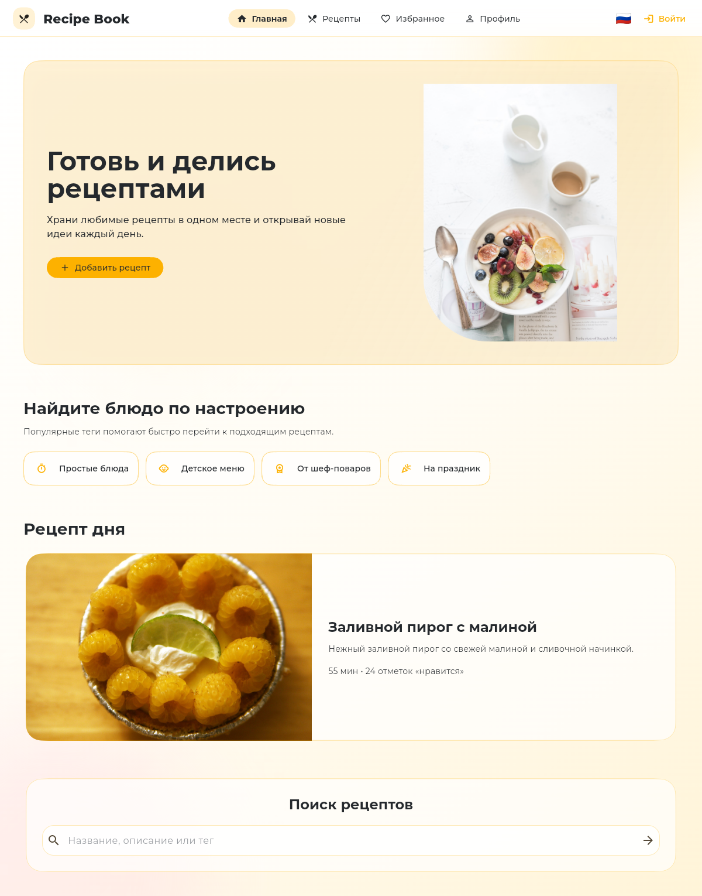
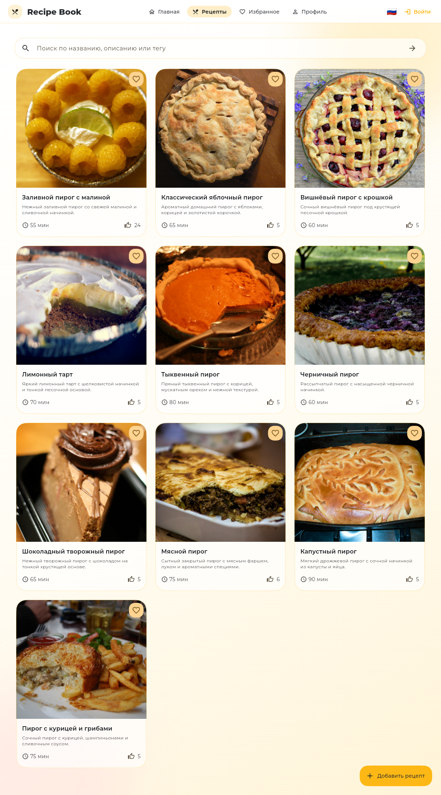
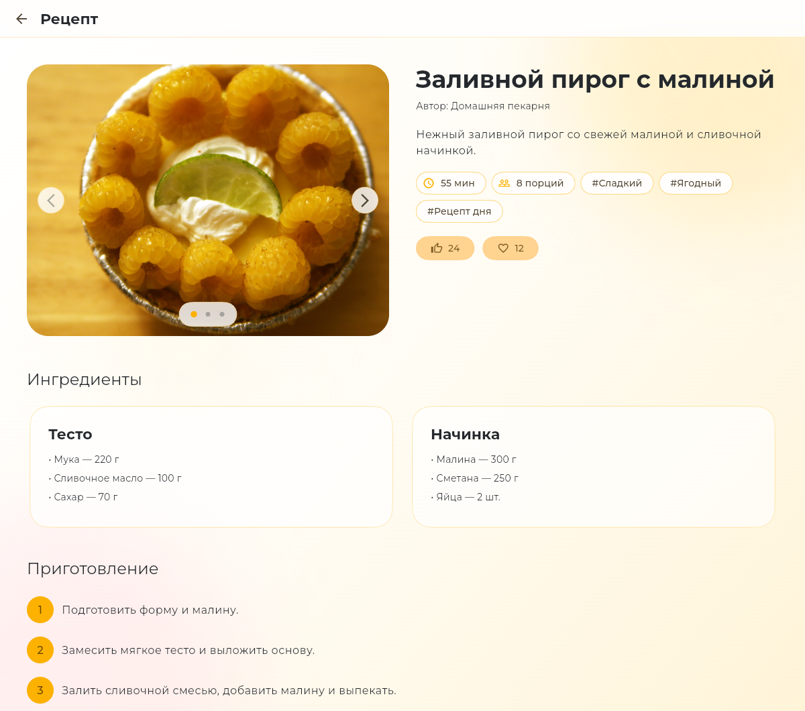

# Recipe Book

Recipe Book is an adaptive, cross-platform Flutter application for discovering, creating, and sharing recipes. Its responsive interface is designed for Android, iOS, web, Windows, macOS, and Linux.

## Features

- Browse and search the recipe catalog.
- View the recipe of the day, image galleries, ingredients, and cooking steps.
- Create, edit, and delete recipes with multiple images.
- Like recipes and save them to favorites.
- Sign in, register, and manage a personal profile.
- Switch between Russian and English.
- Use layouts adapted for compact, tablet, and desktop widths.

## Screenshots

### Home



### Recipes



### Recipe details



## Backend

A backend is required for the application to work. Run either [RecipeBookBackendDotnet](https://github.com/Carapacik/RecipeBookBackendDotnet) or [recipe-book-backend-nestjs](https://github.com/Carapacik/recipe-book-backend-nestjs) with Docker:

```shell
cd <backend-directory>
docker compose up --build
```

The backend must expose its API at `http://localhost:8080/api`.

## Run

```shell
flutter run --dart-define=API_BASE_URL=http://localhost:8080/api
```
